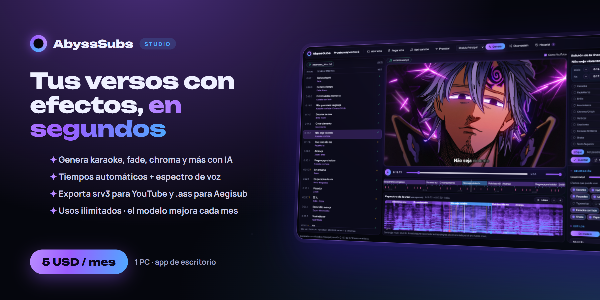

# 🌌 AbyssSubs Studio v1.0.2

Subtítulos con efectos para YouTube (srv3) hechos con IA: cargás el video y la letra, y la app arma el karaoke, los colores, los fades y los textos superiores sincronizados con la voz.

> ⚠️ **Software propietario — Todos los derechos reservados.** No es de código abierto. Prohibido copiar, redistribuir, hacer ingeniería inversa o reutilizar el modelo. Ver [LICENSE.txt](LICENSE.txt).

> ## 💎 Cómo activar tu suscripción (5 USD al mes, 1 PC)
> 1. Abrí la app: en la pantalla de activación aparece **tu ID** (ej. `AB12-CD34`).
> 2. Suscribite al nivel **AbyssSubs Studio** en **[ko-fi.com/sonizzidk](https://ko-fi.com/sonizzidk)**.
> 3. Entrá a **[abysssubs.abysstudio.workers.dev/activar-app](https://abysssubs.abysstudio.workers.dev/activar-app)** y pegá tu ID con el mail de Ko-fi.
> 4. Volvé a la app y tocá **Revisar de nuevo**. ¡Listo!
>
> Los días que te quedan se ven en **Configuración › Suscripción**.

## ✨ Qué hace
- 🎤 **Separa la voz** y alinea cada sílaba con la letra (español, portugués, inglés; japonés opcional).
- 🎨 **Efectos con IA** entrenada con subtítulos hechos a mano: karaoke, brillo, FadeWorks, chroma, glitch, zoom, capa oscura y más.
- 🌊 **Efectos a elección**: Karaoke Cascada, Karaoke Reverso, Degradado con tus colores y Onda RGB.
- 📥 **Importá un .ass ya editado**: se conserva tal cual y elegís en qué líneas generar efectos nuevos.
- ✂️ **Separar versos**: corta las líneas largas y acomoda la letra escrita de corrido (letra pegada o .txt).
- 📈 **Espectro de la voz** con barras de inicio y fin para ajustar tiempos (estilo Aegisub).
- 🔎 **Filtro por efecto** en la lista de líneas, **historial de versiones** y líneas **comentadas**.
- 🖼️ **Galería de efectos**: mirá cómo se ve cada uno antes de elegirlo.
- 🎨 **Colores de la app** personalizables y presencia en **Discord**.
- 🌎 Traduce los subtítulos con **tu propia clave de Gemini** (opcional).

## 💻 Requisitos

| | Mínimo | Recomendado |
|---|---|---|
| **Sistema** | Windows 10 de 64 bits (22H2) | Windows 11 de 64 bits |
| **Procesador** | 4 núcleos (Intel i5 8.ª gen / Ryzen 5 2600) | 6 núcleos o más (i5 12.ª gen / Ryzen 5 5600) |
| **Memoria RAM** | 8 GB | 16 GB |
| **Placa de video** | No hace falta: anda con el procesador (más lento) | Ver la tabla de abajo |
| **Espacio libre** | ~4 GB + 1,2 GB por idioma de voz (SSD) | ~7 GB libres |
| **Internet** | La primera vez (descargas) y para validar la suscripción | — |

### 🎮 Placa de video (opcional, para que sea más rápido)

| | Placa | Notas |
|---|---|---|
| **NVIDIA (recomendado)** | Mínimo: **GTX 1650 4 GB** · Ideal: **RTX 3060 12 GB** | Usa CUDA, es el camino más probado y estable. 6 GB o más para la separación completa sin problemas. |
| **AMD / Intel** | Mínimo: **Radeon RX 570** · Ideal: **RX 6600 / RX 7600** o superior | Usa DirectML (cualquier placa con DirectX 12). Acelera la separación de la voz. |
| **Sin placa** | — | Funciona con el procesador: separar una canción tarda unos minutos en vez de segundos. |

- Con **placa NVIDIA** se instala el motor de IA con CUDA (~2,5 GB) y separar tarda segundos. Con **placa AMD/Intel** se usa DirectML. **Sin placa** anda con el procesador (~200 MB). El asistente te deja elegir el motor.
- En placas con menos de 6 GB conviene la separación **Liviana** (Configuración), que usa menos memoria.
- Hace falta **Microsoft Edge WebView2** (ya viene con Windows 11 y con Windows 10 actualizado).

## 🔧 Instalación
1. Bajá **`AbyssSubs-Studio-Instalador-v1.0.2.exe`** de **Releases**.
2. Abrilo y tocá **Instalar** (no pide permisos de administrador). Se crean los accesos directos en el menú Inicio y el escritorio.
3. La primera vez que abrís la app aparece el **asistente**: elegí los idiomas de tus canciones y tocá **Instalar**. Baja el motor de IA, ffmpeg y los modelos (una sola vez).
4. Activá tu suscripción (arriba) y a subtitular.

> Si Windows muestra «Windows protegió su PC» (SmartScreen), tocá **Más información › Ejecutar de todas formas**: pasa con los programas nuevos que todavía no tienen firma digital.

**Actualizar:** la app se actualiza sola desde GitHub (Configuración › Actualizaciones). Si tenés la 1.0, bajá **`AbyssSubs-Studio-Actualizacion-v1.0.2.exe`** y abrilo una vez: reemplaza solo el código, sin volver a bajar el motor de IA ni tocar tus proyectos.

**Desinstalar:** Configuración de Windows › Aplicaciones › AbyssSubs Studio › Desinstalar. Te pregunta si querés guardar tus proyectos en Documentos.

## 🌍 Traducciones (opcional)
1. Creá tu clave gratis en **[aistudio.google.com/apikey](https://aistudio.google.com/apikey)**.
2. Pegala en **Configuración › Traducciones**. Queda solo en tu PC.

---

# 🌌 AbyssSubs Studio v1.0.2 (English)

AI-made effect subtitles for YouTube (srv3). Load the video and the lyrics, and the app builds karaoke, colors, fades and top titles synced to the voice.

> ⚠️ **Proprietary software — All rights reserved.** Not open-source. The app and the AI model belong to the author; the model was trained on the author's and collaborating subtitlers' projects. Copying, redistributing, reverse-engineering or reusing the model is prohibited. See [LICENSE.txt](LICENSE.txt).

> ## 💎 How to activate your subscription (5 USD/month, 1 PC)
> 1. Open the app. The activation screen shows **your ID** (e.g. `AB12-CD34`).
> 2. Subscribe to the **AbyssSubs Studio** tier at **[ko-fi.com/sonizzidk](https://ko-fi.com/sonizzidk)**.
> 3. Go to **[abysssubs.abysstudio.workers.dev/activar-app](https://abysssubs.abysstudio.workers.dev/activar-app)** and paste your ID with your Ko-fi email.
> 4. Back in the app, click **Check again**. Done!

## ✨ Features
- 🎤 **Vocal separation** and syllable-level alignment (Spanish, Portuguese, English; Japanese optional).
- 🎨 **AI effects** trained on hand-made subtitles: karaoke, glow, FadeWorks, chroma, glitch, zoom, dark layer and more.
- 🌊 **Pick-your-own effects**: Cascade Karaoke, Reverse Karaoke, custom Gradient and RGB Wave.
- 📥 **Import an already-edited .ass**: kept as is; you choose which lines get new effects.
- ✂️ **Verse splitting** for pasted/.txt lyrics, **voice spectrogram** timing, **effect filter**, **version history**, commented lines.
- 🖼️ **Effect gallery**, custom **app colors** and **Discord** presence.
- 🌎 Translations with **your own Gemini key** (optional).

## 💻 Requirements

| | Minimum | Recommended |
|---|---|---|
| **OS** | Windows 10 64-bit (22H2) | Windows 11 64-bit |
| **CPU** | 4 cores (Intel i5 8th gen / Ryzen 5 2600) | 6+ cores (i5 12th gen / Ryzen 5 5600) |
| **RAM** | 8 GB | 16 GB |
| **GPU** | Not required: runs on CPU (slower) | See the table below |
| **Free disk** | ~4 GB + 1.2 GB per voice language (SSD) | ~7 GB free |
| **Internet** | First run (downloads) and subscription checks | — |

### 🎮 GPU (optional, for speed)

| | Card | Notes |
|---|---|---|
| **NVIDIA (recommended)** | Min: **GTX 1650 4 GB** · Ideal: **RTX 3060 12 GB** | Uses CUDA — the most tested, stable path. 6 GB+ for full separation without issues. |
| **AMD / Intel** | Min: **Radeon RX 570** · Ideal: **RX 6600 / RX 7600** or newer | Uses DirectML (any DirectX 12 GPU). Accelerates vocal separation. |
| **No GPU** | — | Works on CPU: separating a song takes minutes instead of seconds. |

On cards with less than 6 GB, use the **Liviana (light)** separation in Settings. Requires **Microsoft Edge WebView2** (included in Windows 11 and updated Windows 10).

## 🔧 Installation
1. Download **`AbyssSubs-Studio-Instalador-v1.0.2.exe`** from **Releases**.
2. Run it and click **Install** (no admin rights needed).
3. On first launch the **setup wizard** downloads the AI engine, ffmpeg and the models (only once).
4. Activate your subscription and start subtitling.

> If SmartScreen says "Windows protected your PC", click **More info › Run anyway** (new unsigned apps show this).

## 🌍 Translations (optional)
Create a free key at **[aistudio.google.com/apikey](https://aistudio.google.com/apikey)** and paste it in **Settings › Translations**.
